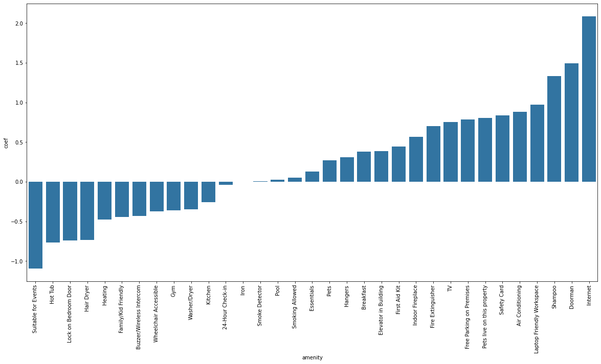

What kind of facilities are provided by AirBnB listings? How does the different facilities provided by AirBnB listings determine the prices and the ratings they get. I worked with the dataset of Seattle listings to find out.

## Whare are the popular amenities?

These are the facilities/amenities shown as a word cloud. Kitchen, Internet and Heating are the most common. 

For a more granular look, here is a bar chart of the counts of features.

Smoke detectors, Essentials, Blowers/Dryers and TV follow Internet, Heating and Kitchen.

The least frequent ones are smoking allowed, doorman and bathroom doors. But I guess these are things that the hosts do not bother adding.  

## How does amenities influcnce the price of the listing?

To see how the amenities affect the price, I got this bar chart for mean price for each amenities when that thing is present and absent.

From the chart it can be seen that there is significant difference for amenities like gyms, hottubs, fireplace and pool come for only highly priced listings.

For some things, I cannot make any observation as the variation in the mean prices is high, such as for Essentials and Internet.

It is interesting to note that places that provide breakfast are priced lower than that provide breakfast. Perhaps, the high-end places charge separately for breakfast and don't offer them for free.

To see more clearly how these amenities variables influence the price variable, I made a Linear Regression model and the coefficients are like this. 

From this, we can observe that variables like doorman, TV, fireplace etc. drive up the price.

## How does amenities influence the rating of the listing?

Just like for price, I tried the same kind of graphs for the rating users give for the place out of ten. 

The mean rating for the listings based on availability of amenities is in this bar chart

Here, only Internet has a big different in how people rate the place. Absence of internet access, makes people give significantly lower ratings.

The chart below gives the coeffients of how each amenities affect rating in a Linear Regression model

Here Internet is the dominant one, with the coefficient value being more than double most of other amenities' coefficients.

## Which amenities ususally come together?

To see which amenities occur together, I got the Person's Cofficient for each pair of amenities. This is that heatmap.

The bright colored parts indicate that when there is ironing facility, hangers and hair dryers are also usually present. Properties that have pets living, allow hosts to bring pets.

## Outro

Using insights from this, it is possible for hosts to do things to their properties so that they can raise their prices and get better rating. Simply making sure there Internet or Shampoo available gets them a bigger rating. 

More details can be found in the notebooks available in [this GitHub repository](https://github.com/sivakar12/seattle-airbnb-nanodegree-project)